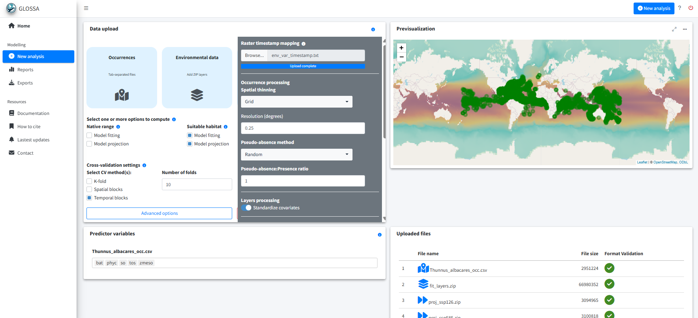
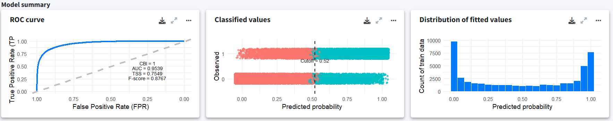
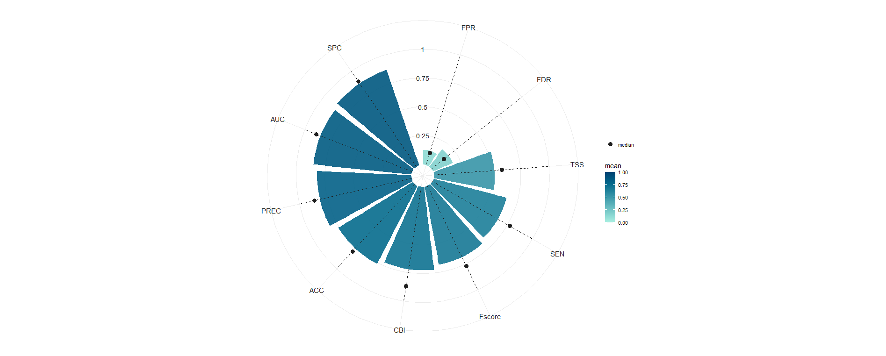
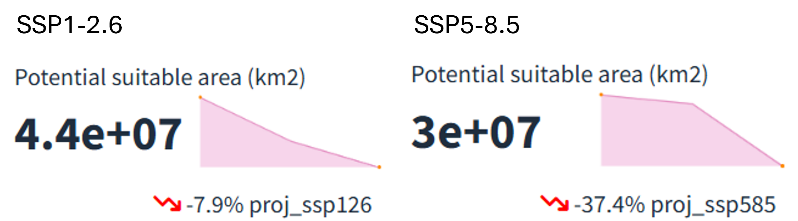
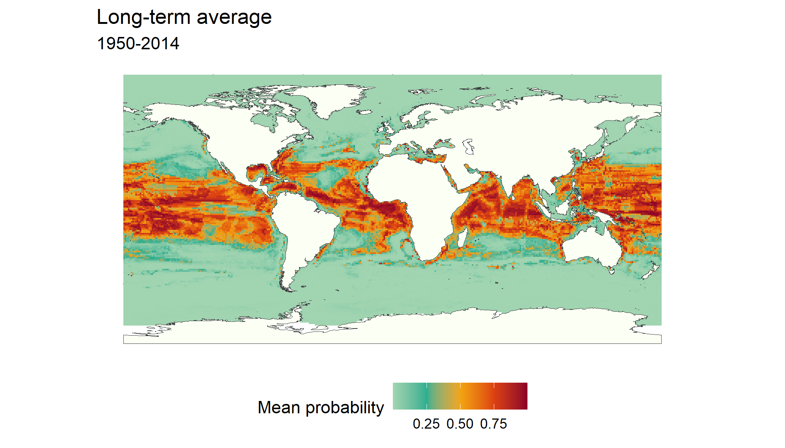
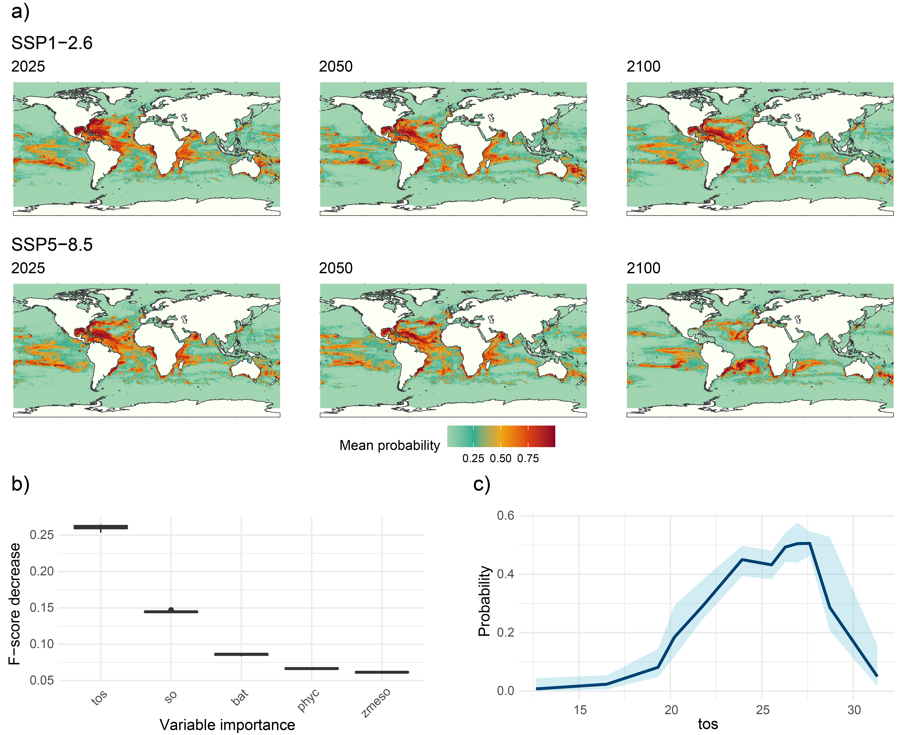

```{r, global_options}
#| echo: false
run_code <- FALSE
```

## Introduction

This example shows how to use the GLOSSA framework to model the suitable habitat of *Thunnus albacares* (yellowfin tuna) on a global scale under different climate change scenarios. We combined occurrence data (1950-2014) from the Ocean Biogeographic Information System (OBIS, <https://obis.org/>) with environmental predictors from the Inter-Sectoral Impact Model Intercomparison Project (ISIMIP, <https://data.isimip.org/>). The goal is to evaluate how habitat suitability for *T. albacares* may change under two scenarios: sustainable development (SSP1-2.6) and high emissions (SSP5-8.5).

To reproduce the analysis, we load the `glossa` package, as well as `terra` (Hijmans, 2024) and `sf` (Pebesma, 2018) which are used to handle spatial rasters and vector data. The `robis` package (Provoost *et al*., 2022) allow us to access OBIS occurrence records, while `CoordinateCleaner` is used for cleaning occurrence records. Finally, `dplyr` (Wickham *et al*., 2023) is used for data manipulation.

```{r}
#| eval: !expr run_code

library(glossa)
library(terra)
library(sf)
library(robis)
library(CoordinateCleaner)
library(dplyr)
```

## Data preparation 

### Download occurrence data

We download occurrence data for *T. albacares* from OBIS (OBIS, 2025; <https://obis.org/taxon/127027>) using the `robis` package. We retain only presence records, remove preserved specimens, restrict the temporal range to 1950-2014 to match with the temporal coverage of our environmental predictors. We also apply `CoordinateCleaner` for quality check and cleaning of occurrence records retrieved from OBIS (Zizka *et al*., 2019). Finally, we select the necessary columns for GLOSSA (`decimalLongitude`, `decimalLatitude`, `timestamp` and `pa`) and reformat presences to `pa = 1` (where `1` represents presence and `0` (pseudo-)absence, as required by GLOSSA).

```{r}
#| eval: !expr run_code

# Download occurrence data from OBIS
albacares <- robis::occurrence(scientificname = "Thunnus albacares")

# Keep presence records only
albacares <- albacares[albacares$occurrenceStatus %in%
                         c("present", "Present", "Presente", "P"), ]

# Remove fossils and preserved specimens
albacares <- albacares[!albacares$basisOfRecord %in%
                         c("PreservedSpecimen", "preservedspecimen"), ]

# Filter occurrences between 1950-2014 to match environmental data
albacares <- albacares[albacares$date_year>=1950 & albacares$date_year<=2014,]

# Remove incomplete records (with NA values)
albacares <- albacares[complete.cases(albacares[, c("decimalLongitude",
                                                    "decimalLatitude",
                                                    "date_year",
                                                    "occurrenceStatus")]), ]

# CoordinateCleaner (institutions tests, zeros, validity checks)
flags <- CoordinateCleaner::clean_coordinates(
  x = albacares,
  lon = "decimalLongitude",
  lat = "decimalLatitude",
  species ="species",
  tests = c("institutions", "validity", "zeros")
)
albacares <- albacares[flags$.summary, ]

# Reformat data to fit GLOSSA - select and rename columns of interest
albacares <- albacares[, c("decimalLongitude", "decimalLatitude",
                           "date_year", "occurrenceStatus")]
colnames(albacares) <-c("decimalLongitude","decimalLatitude","timestamp","pa")
albacares$pa <- 1 # Convert presence data to 1 (for presences)

summary(albacares)

# Save to file
write.table(as.data.frame(albacares), file = "data/Thunnus_albacares_occ.csv", 
            sep = "\t", dec = ".", quote = FALSE)
```

### Download environmental data

We obtain environmental data from ISIMIP, using the GFDL-ESM4 Earth System Model from the ISIMIP3b climate dataset. The downloaded variables are:

- [Sea surface temperature](https://files.isimip.org/ISIMIP3b/InputData/climate/ocean/uncorrected/global/monthly/historical/GFDL-ESM4/gfdl-esm4_r1i1p1f1_historical_tos_60arcmin_global_monthly_1850_2014.nc) (`tos`, ºC)
- [Sea surface water salinity](https://files.isimip.org/ISIMIP3b/InputData/climate/ocean/uncorrected/global/monthly/historical/GFDL-ESM4/gfdl-esm4_r1i1p1f1_historical_so-surf_60arcmin_global_monthly_1850_2014.nc) (`so`, psu)
- [Phytoplankton carbon content vertically integrated over all oceans levels](https://files.isimip.org/ISIMIP3b/InputData/climate/ocean/uncorrected/global/monthly/historical/GFDL-ESM4/gfdl-esm4_r1i1p1f1_historical_phyc-vint_60arcmin_global_monthly_1850_2014.nc) (`phyc`, $mol / m^2$)
- [Mesozooplankton carbon content vertically integrated over all oceans levels](https://files.isimip.org/ISIMIP3b/InputData/climate/ocean/uncorrected/global/monthly/historical/GFDL-ESM4/gfdl-esm4_r1i1p1f1_historical_zmeso-vint_60arcmin_global_monthly_1850_2014.nc) (`zmeso`, $mol / m^2$)

Additionally, we download bathymetry data from the [ETOPO 2022 Global Relief Model](https://www.ncei.noaa.gov/products/etopo-global-relief-model) by the National Oceanic and Atmospheric Administration (NOAA, \url{https://www.noaa.gov/}). We download the [bedrock elevation netCDF version ETOPO 2022](https://www.ngdc.noaa.gov/thredds/catalog/global/ETOPO2022/60s/60s_bed_elev_netcdf/catalog.html?dataset=globalDatasetScan/ETOPO2022/60s/60s_bed_elev_netcdf/ETOPO_2022_v1_60s_N90W180_bed.nc) with a 60 arc-second resolution that we aggregate to match the ISIMIP layers resolution.


```{r}
#| eval: !expr run_code

# Load environmental data layers
tos <- "gfdl-esm4_r1i1p1f1_historical_tos_60arcmin_global_monthly_1850_2014.nc"
so <- "gfdl-esm4_r1i1p1f1_historical_so-surf_60arcmin_global_monthly_1850_2014.nc"
phyc <- "gfdl-esm4_r1i1p1f1_historical_phyc-vint_60arcmin_global_monthly_1850_2014.nc"
zmeso<-"gfdl-esm4_r1i1p1f1_historical_zmeso-vint_60arcmin_global_monthly_1850_2014.nc"
env_data <- list(
  tos = terra::rast(file.path("data", tos)),
  so = terra::rast(file.path("data", so)),
  phyc = terra::rast(file.path("data", phyc)),
  zmeso = terra::rast(file.path("data", zmeso))
)

# Process data to calculate annual means for each variable from 1950 to 2014
env_data_year <- list()
n <- 1
# We have monthly environmental data from 1850 to 2014
# So month nº 1189 corresponds to Jan 1950 until Dec 2014 (month nº 1980)
for (i in seq(from = 1189, to = (1980 - 12), by = 12)){
    for (j in names(env_data)){
        env_data_year[[j]][[n]] <- terra::mean(env_data[[j]][[i:(i+11)]])
    }
    n <- n + 1
}

# Prepare bathymetry data and resample to match environmental data resolution
bat <- terra::rast("data/ETOPO_2022_v1_60s_N90W180_bed.nc")
bat <- -1*bat
bat <- terra::aggregate(bat, fact = 60, fun = "mean")
r <- terra::rast(terra::ext(env_data_year[[1]][[1]]), 
                 res = terra::res(env_data_year[[1]][[1]]))
bat <- terra::resample(bat, r)
for (i in seq_len(length(env_data_year[[1]]))){
  env_data_year[["bat"]][[i]] <- bat
}

# Save processed layers to files
dir.create("data/fit_layers")
dir.create("data/fit_layers/bat")
dir.create("data/fit_layers/tos")
dir.create("data/fit_layers/so")
dir.create("data/fit_layers/phyc")
dir.create("data/fit_layers/zmeso")
for (i in seq_len(length(env_data_year[[1]]))){
    for (j in names(env_data_year)){
        terra::writeRaster(
            env_data_year[[j]][[i]], 
            filename = paste0("data/fit_layers/", j ,"/", j, "_", i, ".tif")
        )
    }
}

# Zip the output files
zip(zipfile = "data/fit_layers.zip", files = "data/fit_layers")
```

After filtering the occurrences from 1950 to 2014, our first occurrence record is from 1968. GLOSSA assigns the occurrences to the environmental variables by order, so the first year (in this case 1968), will be assigned to the first environmental layer (in this case 1950). We can do two things: (i) remove the layers from 1950 onwards, or (ii) provide a file indicating the assignment of the environmental data to the timestamp. In this example we do the second approach since in the other examples we follow the first one.

```{r}
#| eval: !expr run_code

data.frame(timestamp = 1950:2014) |> 
  write.table(file = "data/env_var_timestamp.txt",
              col.names = FALSE, row.names = FALSE, quote = FALSE)
```


### Climate projections: SSP1-2.6 and SSP5-8.5

We prepare future projections (2015-2100) for SSP1-2.6 and SSP5-8.5 using the same variables (`tos`, `so`, `phyc`, `zmeso`). For each scenario, we aggregate monthly data to annual averages and extract data for years 2025, 2050 and 2100. Bathymetry is added unchanged (static).

#### SSP1-2.6

The following environmental variables are downloaded for the SSP1-2.6 scenario:

- [Sea surface temperature](https://files.isimip.org/ISIMIP3b/InputData/climate/ocean/uncorrected/global/monthly/ssp126/GFDL-ESM4/gfdl-esm4_r1i1p1f1_ssp126_tos_60arcmin_global_monthly_2015_2100.nc) (`tos`, ºC)
- [Sea surface water salinity](https://files.isimip.org/ISIMIP3b/InputData/climate/ocean/uncorrected/global/monthly/ssp126/GFDL-ESM4/gfdl-esm4_r1i1p1f1_ssp126_so-surf_60arcmin_global_monthly_2015_2100.nc) (`so`, psu)
- [Phytoplankton content](https://files.isimip.org/ISIMIP3b/InputData/climate/ocean/uncorrected/global/monthly/ssp126/GFDL-ESM4/gfdl-esm4_r1i1p1f1_ssp126_phyc-vint_60arcmin_global_monthly_2015_2100.nc) (`phyc`, $mol / m^2$)
- [Mesozooplankton content](https://files.isimip.org/ISIMIP3b/InputData/climate/ocean/uncorrected/global/monthly/ssp126/GFDL-ESM4/gfdl-esm4_r1i1p1f1_ssp126_zmeso-vint_60arcmin_global_monthly_2015_2100.nc) (`zmeso`, $mol / m^2$)

```{r}
#| eval: !expr run_code

# Load SSP1-2.6 climate projection data
tos <- "gfdl-esm4_r1i1p1f1_ssp126_tos_60arcmin_global_monthly_2015_2100.nc"
so <- "gfdl-esm4_r1i1p1f1_ssp126_so-surf_60arcmin_global_monthly_2015_2100.nc"
phyc <- "gfdl-esm4_r1i1p1f1_ssp126_phyc-vint_60arcmin_global_monthly_2015_2100.nc"
zmeso <- "gfdl-esm4_r1i1p1f1_ssp126_zmeso-vint_60arcmin_global_monthly_2015_2100.nc"
env_data <- list(
  tos = terra::rast(file.path("data", tos)),
  so = terra::rast(file.path("data", so)),
  phyc = terra::rast(file.path("data", phyc)),
  zmeso = terra::rast(file.path("data", zmeso))
)

# Extract data for 2025, 2050 and 2100
env_data_year <- list()
n <- 1
for (i in c(121, 421, 1021)){
  for (j in names(env_data)){
    env_data_year[[j]][[n]] <- terra::mean(env_data[[j]][[i:(i+11)]])
  }
  n <- n + 1
}

# Add bathymetry data to the layers
for (i in seq_len(length(env_data_year[[1]]))){
  env_data_year[["bat"]][[i]] <- bat
}

# Save projection data to files
dir.create("data/proj_ssp126")
dir.create("data/proj_ssp126/bat")
dir.create("data/proj_ssp126/tos")
dir.create("data/proj_ssp126/so")
dir.create("data/proj_ssp126/phyc")
dir.create("data/proj_ssp126/zmeso")
for (i in seq_len(length(env_data_year[[1]]))){
  for (j in names(env_data_year)){
    terra::writeRaster(
      env_data_year[[j]][[i]], 
      filename = paste0("data/proj_ssp126/", j ,"/", j, "_", i, ".tif")
    )
  }
}

# Zip the output files
zip(zipfile = "data/proj_ssp126.zip", files = "data/proj_ssp126")
```

#### SSP5-8.5

Similarly, we download environmental data for the SSP5-8.5 scenario.

- [Sea surface temperature](https://files.isimip.org/ISIMIP3b/InputData/climate/ocean/uncorrected/global/monthly/ssp585/GFDL-ESM4/gfdl-esm4_r1i1p1f1_ssp585_tos_60arcmin_global_monthly_2015_2100.nc) (`tos`, ºC)
- [Sea surface water salinity](https://files.isimip.org/ISIMIP3b/InputData/climate/ocean/uncorrected/global/monthly/ssp585/GFDL-ESM4/gfdl-esm4_r1i1p1f1_ssp585_so-surf_60arcmin_global_monthly_2015_2100.nc) (`so`, psu)
- [Phytoplankton content](https://files.isimip.org/ISIMIP3b/InputData/climate/ocean/uncorrected/global/monthly/ssp585/GFDL-ESM4/gfdl-esm4_r1i1p1f1_ssp585_phyc-vint_60arcmin_global_monthly_2015_2100.nc) (`phyc`, $mol / m^2$)
- [Mesozooplankton content](https://files.isimip.org/ISIMIP3b/InputData/climate/ocean/uncorrected/global/monthly/ssp585/GFDL-ESM4/gfdl-esm4_r1i1p1f1_ssp585_zmeso-vint_60arcmin_global_monthly_2015_2100.nc) (`zmeso`, $mol / m^2$)


```{r}
#| eval: !expr run_code

# Load SSP5-8.5 climate projection data
tos <- "gfdl-esm4_r1i1p1f1_ssp585_tos_60arcmin_global_monthly_2015_2100.nc"
so <- "gfdl-esm4_r1i1p1f1_ssp585_so-surf_60arcmin_global_monthly_2015_2100.nc"
phyc <- "gfdl-esm4_r1i1p1f1_ssp585_phyc-vint_60arcmin_global_monthly_2015_2100.nc"
zmeso <- "gfdl-esm4_r1i1p1f1_ssp585_zmeso-vint_60arcmin_global_monthly_2015_2100.nc"
env_data <- list(
  tos = terra::rast(file.path("data", tos)),
  so = terra::rast(file.path("data", so)),
  phyc = terra::rast(file.path("data", phyc)),
  zmeso = terra::rast(file.path("data", zmeso))
)

# Extract data for 2025, 2050 and 2100
env_data_year <- list()
n <- 1
for (i in c(121, 421, 1021)){
  for (j in names(env_data)){
    env_data_year[[j]][[n]] <- terra::mean(env_data[[j]][[i:(i+11)]])
  }
  n <- n + 1
}

# Add bathymetry data to the layers
for (i in seq_len(length(env_data_year[[1]]))){
  env_data_year[["bat"]][[i]] <- bat
}

# Save projection data to files
dir.create("data/proj_ssp585")
dir.create("data/proj_ssp585/bat")
dir.create("data/proj_ssp585/tos")
dir.create("data/proj_ssp585/so")
dir.create("data/proj_ssp585/phyc")
dir.create("data/proj_ssp585/zmeso")
for (i in seq_len(length(env_data_year[[1]]))){
  for (j in names(env_data_year)){
    terra::writeRaster(
      env_data_year[[j]][[i]], 
      filename = paste0("data/proj_ssp585/", j ,"/", j, "_", i, ".tif")
    )
  }
}

# Zip the output files
zip(zipfile = "data/proj_ssp585.zip", files = "data/proj_ssp585")
```

## GLOSSA modelling

With the occurrence and environmental data prepared, we can now fit the habitat suitability model in GLOSSA.

```{r}
#| eval: !expr run_code

run_glossa()
```

We upload the occurrence file for *T. albacares* (`Thunnus_albacares_occ.csv`), the environmental layers for model fitting (`fit_layers.zip`) and the two projection scenarios (`proj_ssp126.zip`, `proj_ssp585.zip`). We also provide the timestamp mapping file (`env_var_timestamp.txt`) to align years between occurrences and environmental predictors.

Since the goal is to estimate suitable habitat, we select the *Model fitting* and *Model projection* options under the *Suitable habitat* model. Additionally, we enable *Functional responses* and *Variable importance* in the *Others* section to compute the response curves and asses the contribution of predictors. We also select *Cross-validation* for model evaluation. For that we use a 10-fold cross-validation using temporal splits. We choose temporal blocks because spatial blocks produced folds with only pseudo-absences and no presences, which cannot be properly used for model evaluation.

We apply spatial thinning using a grid of 0.25º cell size, generate pseudo-absences using balanced random sampling (1:1 ratio) and standardize the environmental predictors.

To reduce overfitting, we adjusted the model options by reducing the number of trees to 100 to simplify the model and improve generalization. Alternatively, we can also tune the prior parameter $k$, which controls the amount of shrinkage of the node parameters, where higher values of $k$ result in greater shrinkage, producing a more conservative fit.

The number of trees (`n.trees` in `dbarts::bart()`) determines how many trees are combined in the sum-of-trees model. Larger numbers of trees lead to increased representation flexibility and can increase predictive accuracy, but they also raise redundancy across trees and there's a point where it can even degrade for large values (Chipman *et al*., 2010). Regularization priors help control overfitting. In BART, terminal node values follow a $N(0, \sigma^2_\mu)$ prior with variance $\sigma^2_\mu = 0.5 / k \sqrt{m}$, where $m$ is the number of trees and $k$ is a shrinkage parameter. Increasing either $m$ or $k$ makes the prior tighter, producing greater shrinkage and more conservative fits (Chipman *et al*., 2010; Dorie, 2024). Therefore, carefully tuning these parameters can help mitigate overfitting.

Finally we set the seed to 776 for reproducibility.

{fig-align="center" fig-pos="H"}

## Results

In the *Reports* section, we explore the model outputs and projections for both climate scenarios (SSP1-2.6 and SSP5-8.5). The model was fit using a total of 24,349 presence records. The model summary shows decent performance with high AUC and Continuous Boyce Index (CBI) values. The middle plot shows the optimal classification cutoff based on the True Skill Statistic (TSS) and the rightmost plot displays the distribution of fitted values.

{width=100% fig-align="center" fig-pos="H"}

In order to test the model with more independent data to check if we are overfitting the presences we used a temporal block cross-validation. We see that while the TSS seems low, the AUC and the precision of the presences is high indicating it finds presences where they should be, but the sensitivity is a bit lower with a median value around 0.75, indicating that some presences are not detected, highlighting a more conservative model behavior. This is reflected in the F-score and TSS. However, when working with a presence-only model with pseudo-absences, these metrics can be misleading as we don't have real absences and we are not modelling the probability of presences as our pseudo-absences represent the availability. In such cases, there are more appropriate metrics designed for these cases such as the CBI, that in this case shows a median value of 0.87.

{width=60% fig-align="center" fig-pos="H"}

After selecting the desired climate scenario in the *GLOSSA predictions* box, we can view the evolution of the potential suitable area over time for the projected layers (2025, 2050 and 2100) in the top section. For both climate scenarios, a reduction in the potential suitable habitat area ($km^2$) is evident, with a more pronounced decline under the high-emission scenario (37.4% reduction) compared to the low-emission scenario (7.9% reduction).

{width=60% fig-align="center" fig-pos="H"}

The *GLOSSA predictions* tab allows us to explore projections for the uploaded layers across different years and climate scenarios. Using the *fit_layers* option, we can see the predictions for the long-term average between 1950 and 2014 which is the period used to fit the model.

{width=60% fig-align="center" fig-pos="H"}

When looking at the future projections, the results reveal a decline in habitat suitability from 2025 to 2100 for both SSP1-2.6 (low-emission) and SSP5-8.5 (high-emission) scenarios. Under the SSP5-8.5 scenario, the decrease in habitat suitability is not only more pronounced, but the species' distribution has also shifted away from equatorial and tropical regions towards subtropical zones, highlighting the impact of higher emissions on species distributions.

{width=60% fig-align="center" fig-pos="H"}

The *Variable importance* plot shows which predictor variables are playing a more important role in predicting the species occurrences. Sea surface temperature appears as the variable that most improves predictive performance, followed by salinity and bathymetry, which also contribute meaningfully to the model's accuracy. In contrast, primary productivity has a lower importance score, suggesting it provides less predictive power compared to the other variables in this model.

Finally, we have computed the response curve for each predictor variable. The response curve for sea surface temperature indicates that the probability of species presence peaks at around 25°C, illustrating the species’ preference for moderate water temperatures. As temperatures deviate from this optimal range, the probability of occurrence declines sharply, underscoring the species' vulnerability to temperature changes.

## Conclusion

This example shows how GLOSSA can be used to model the global distribution of *Thunnus albacares* and assess potential shifts in its habitat under different climate scenarios.

## Computation time

The analysis was performed on a single Windows 11 machine equipped with 64 GB of RAM and an Intel(R) Core(TM) i7-1165G7 processor. This processor features 4 cores and 8 threads, with a base clock speed of 2.80 GHz. The following table summarizes the computation times for various stages of the GLOSSA analysis. This provides an overview of the computational resources required for each step in the analysis.

<p align="center"><b>Table 1.</b> Computation times for different stages of the GLOSSA analysis for the global scale example.</p>
| **Task**                                 | **Execution time**         |
|------------------------------------------|----------------------------|
| Loading input data                       | 20.8 secs                  |
| Processing P/A coordinates               | 1.26 secs                  |
| Processing covariate layers              | 12.9 secs                  |
| Building model matrix                    | 388  secs                  |
| Fitting suitable habitat models          | 1.91 mins                  |
| Variable importance (suitable habitat)   | 54   mins                  |
| P/A cutoff (suitable habitat)            | 2.11 mins                  |
| Projections on fit layers (suitable habitat) | 2.42 mins              |
| Suitable habitat future projections             | 2.18 mins                  |
| Computing functional responses           | 46.29 mins                 |
| Cross-validation                         | 17.73 mins                 |
| **Total GLOSSA analysis**                | **133.7 mins**             |

## References

- Chipman, H. A., George, E. I., & McCulloch, R. E. (2010). BART: Bayesian additive regression trees. *The Annals of Applied Statistics*, 4(1):266 – 298.

- Dorie V. (2025). *dbarts: Discrete Bayesian Additive Regression Trees Sampler*. R package version 0.9-32, <https://CRAN.R-project.org/package=dbarts>.

- Hijmans, R. (2024). *terra: Spatial Data Analysis*. R package version 1.7-81, <https://rspatial.github.io/terra/>, <https://rspatial.org/>.

- OBIS (2025). Distribution records of *Thunnus albacares* (Bonnaterre, 1788). (Available: Ocean Biodiversity Information System. Intergovernmental Oceanographic Commission of UNESCO. <https://obis.org/taxon/127027>. Accessed: 2025-06-11).

- Pebesma E. (2018). Simple Features for R: Standardized Support for Spatial Vector Data. *The R Journal*, 10(1), 439–446. <https://doi.org/10.32614/RJ-2018-009>

- Provoost P., Bosch S., Appeltans W., & OBIS (2022). *robis: Ocean Biodiversity Information System (OBIS) Client*. R package version 2.11.3, <https://cran.r-project.org/package=robis>.

- Wickham H., François R., Henry L., Müller K. & Vaughan D. (2023). *dplyr: A Grammar of Data Manipulation.* R package version 1.1.4, <https://github.com/tidyverse/dplyr>, <https://dplyr.tidyverse.org>.

- Zizka A., Silvestro D., Andermann T., Azevedo J., Duarte Ritter C., Edler D., Farooq H., Herdean A., Ariza M., Scharn R., Svanteson S., Wengtrom N., Zizka V. & Antonelli A. (2019). CoordinateCleaner: Standardized cleaning of occurrence records from biological collection databases. *Methods in Ecology and Evolution, 10*(5):744-751.  <https://doi.org/10.1111/2041-210X.13152>, <https://github.com/ropensci/CoordinateCleaner>

