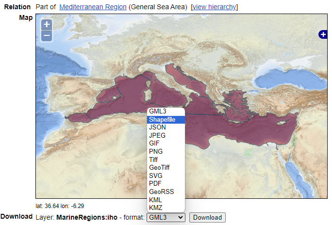
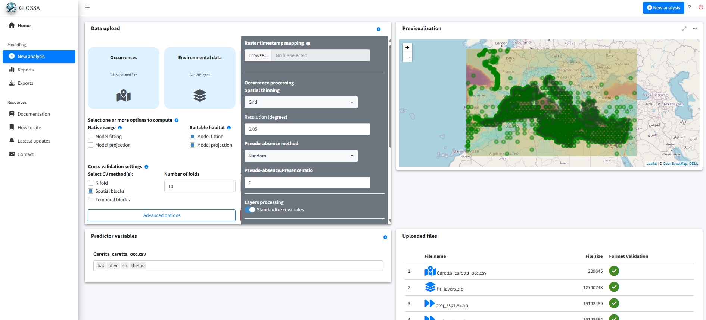
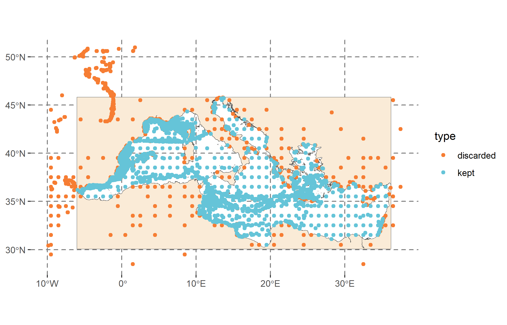
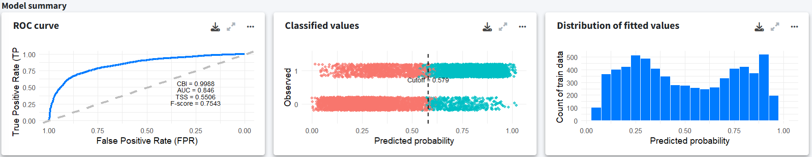
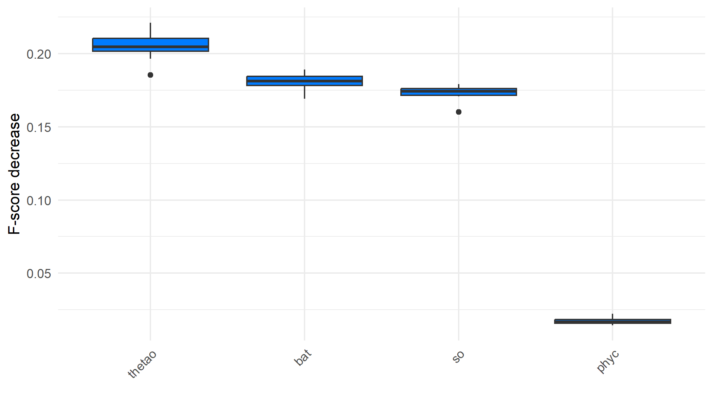
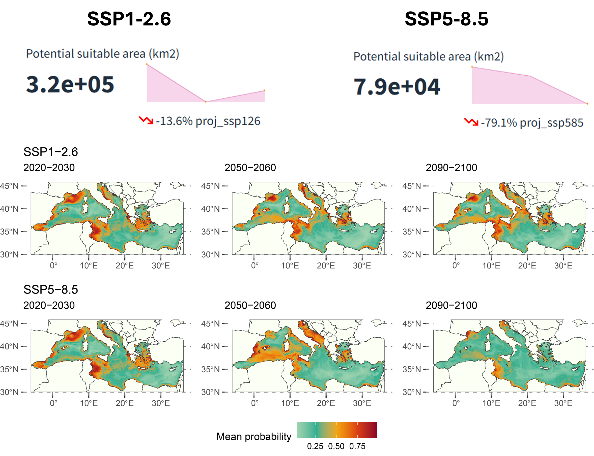

```{r, global_options}
#| echo: false
run_code <- FALSE
```

## Introduction

This vignette provides a detailed example of fitting a single-species distribution model within a user-defined region. We will walk through the steps of obtaining occurrence data, gathering environmental data and defining the study area using a polygon. The example focuses on the distribution of the loggerhead sea turtle (*Caretta caretta*) in the Mediterranean Sea. Occurrence data will be retrieved from the Global Biodiversity Information Facility (GBIF, <https://www.gbif.org/>) for the years 2000 to 2019 and environmental data from Bio-ORACLE v3.0 (Assis *et al.*, 2024). We will use GLOSSA to fit a species distribution model and project it under different future climate scenarios.

To get started, we load the `glossa` package, as well as `terra` (Hijmans, 2024) and `sf` (Pebesma, 2018) to work with spatial rasters and vector data. We also load `rgbif` (Chamberlain, 2017) and `biooracler` (Fernandez Bejarano and Salazar, 2024) for downloading species occurrences and environmental data, respectively. Additionally, the `dplyr` (Wickham *et al*., 2023) package will be used for data manipulation.

```{r}
#| eval: !expr run_code

library(glossa)
library(terra)
library(sf)
library(rgbif)
library(biooracler)
library(dplyr)
```

## Data preparation 

### Download occurrence data

We download occurrence data for *C. caretta* in the Mediterranean Sea using the GBIF API. We filter the data by date and geographic boundaries to fit the Mediterranean region and align with the temporal scale of the environmental data from Bio-ORACLE. To use the GBIF API, you need to have a registered GBIF account (`user`, `pwd` and `email`). First, we retrieve the taxon key for *C. caretta* and then use `occ_download()` from the `rgbif` package to download the occurrences. To restrict the download to the Mediterranean Sea, we use the `pred_within()` argument and define a polygon of interest (`"POLYGON ((-10 28, 38 28, 38 51, -10 51, -10 28))"`). Since Bio-ORACLE provides environmental layers in decadal steps, we limit the occurrence data to points between 2000 and 2019.

```{r}
#| eval: !expr run_code

# Function to retrieve taxon key from scientific name
get_taxon_key <- function(name) {
  result <- rgbif::occ_search(scientificName = name, hasCoordinate = TRUE)
  if (!is.null(result$data)) {
    return(as.character(result$data$taxonKey[1]))
  } else {
    warning(paste("No taxon key found for", name))
    return(NA)
  }
}

# Define GBIF credentials and species information
user <- "<gbif username>"
pwd <- "<password>"
email <- "<gbif mail>"
taxon_key <- get_taxon_key("Caretta caretta")

# Download GBIF occurrence data
request_id <- as.character(rgbif::occ_download(
  rgbif::pred("taxonKey", taxon_key),
  rgbif::pred("hasCoordinate", TRUE),
  rgbif::pred_within("POLYGON ((-10 28, 38 28, 38 51, -10 51, -10 28))"),
  rgbif::pred("occurrenceStatus", "PRESENT"),
  rgbif::pred_gte("YEAR", 2000),
  rgbif::pred_lte("YEAR", 2019),
  format = "SIMPLE_CSV",
  user = user,
  pwd = pwd,
  email = email
))

response <- rgbif::occ_download_wait(request_id)

if (response$status == "SUCCEEDED"){
  temp <- tempfile(fileext = ".csv")
  download.file(response$downloadLink, temp, mode = "wb")
  caretta <- read.csv(unz(temp, paste0(response$key, ".csv")),
                        header = TRUE, sep = "\t", dec = ".")
}
```

Once we have the dataset, we reformat it to fit GLOSSA. For this, we extract the required record locations (`decimalLongitude` and `decimalLatitude`) and assign a `timestamp` for each record. As Bio-ORACLE provides environmental layers for two decades (2000s and 2010s), we assign points from 2000 to 2009 to the first time period and points from 2010 to 2019 to the second time period. We then create a presence/absence column (`pa`), setting all downloaded records as presences. Finally, we save the file as a tab-separated CSV and retrieve the DOI of the downloaded data from GBIF (GBIF.org, 2024).

```{r}
#| eval: !expr run_code

# Prepare the data for modelling
# Separate timestamp in two decades to fit Bio-ORACLE format (2000s and 2010s)
caretta <- data.frame(
  decimalLongitude = caretta$decimalLongitude,
  decimalLatitude = caretta$decimalLatitude,
  timestamp = ifelse(caretta$year %in% 2000:2009, 1, 2),
  pa = 1
)
caretta <- caretta[complete.cases(caretta),]

# Save the data
dir.create("data")
write.table(caretta, file = "data/Caretta_caretta_occ.csv", sep = "\t",
            dec = ".", quote = FALSE, row.names = FALSE)

# Get citation for the downloaded data
citation <- rgbif::gbif_citation(request_id)$download
citation
# GBIF Occurrence Download https://doi.org/10.15468/dl.es7562
# Accessed from R via rgbif (https://github.com/ropensci/rgbif) on 2024-08-27
```

### Download environmental data

Bio-ORACLE provides environmental layers at a spatial resolution of 0.05 degrees and in decadal steps. We download environmental variables such as ocean surface temperature (`thetao` in $^{\circ}$C), primary productivity (`phyc` in $\text{mol} \cdot \text{m}^{-2}$) and salinity (`so`). Bathymetry (`bat`) is obtained from the ETOPO 2022 Global Relief Model by NOAA (<https://www.ncei.noaa.gov/products/etopo-global-relief-model>).

```{r}
#| eval: !expr run_code

# Define temporal and spatial constraints
time = c("2000-01-01T00:00:00Z", "2010-01-01T00:00:00Z")
latitude = c(28, 51)
longitude = c(-10, 38)
constraints = list(time, longitude, latitude)
names(constraints) = c("time", "longitude", "latitude")

# Download environmental layers from Bio-Oracle
thetao_hist <- download_layers("thetao_baseline_2000_2019_depthsurf", 
                               "thetao_mean", constraints)
phyc_hist <- download_layers("phyc_baseline_2000_2020_depthsurf", 
                             "phyc_mean", constraints)
so_hist <- download_layers("so_baseline_2000_2019_depthsurf", 
                           "so_mean", constraints)

# Download bathymetry data
download.file(
  paste0("https://www.ngdc.noaa.gov/thredds/fileServer/global/ETOPO2022/",
         "60s/60s_bed_elev_netcdf/ETOPO_2022_v1_60s_N90W180_bed.nc"),
  destfile = "data/ETOPO_2022_v1_60s_N90W180_bed.nc"
)
```

We arrange the downloaded environmental data and save it in the directory structure required by GLOSSA.

```{r}
#| eval: !expr run_code

dir.create("data/fit_layers")

# Prepare environmental variables for modelling
env_var <- list(thetao_hist, so_hist, phyc_hist)
names(env_var) <- c("thetao", "so", "phyc")

for (i in seq_along(env_var)) {
  var_dir <- paste0("data/fit_layers/", names(env_var)[i])
  dir.create(var_dir)
  
  terra::writeRaster(
    env_var[[i]][[1]], 
    filename = paste0(var_dir, "/", names(env_var)[i], "_1.tif")
  )
  terra::writeRaster(
    env_var[[i]][[2]],
    filename = paste0(var_dir, "/", names(env_var)[i], "_2.tif")
  )
  
  # Clean up auxiliary files generated by terra - Optional
  aux_files <- list.files(var_dir, pattern="\\.aux\\.json$", full.names=TRUE)
  file.remove(aux_files)
}

# Prepare bathymetry data
bat <- terra::rast("data/ETOPO_2022_v1_60s_N90W180_bed.nc")
bat <- -1 * bat # Change sign from elvation to bathymetry

# Aggregate to match resolution with Bio-ORACLE layers
bat <- terra::aggregate(bat, fact = 3, fun = "mean")
r <- terra::rast(terra::ext(env_var[[1]]), res = terra::res(env_var[[1]]))
bat <- terra::resample(bat, r)

dir.create("data/fit_layers/bat")
for (i in 1:2){
  terra::writeRaster(
    bat, filename = paste0("data/fit_layers/bat/bat_", i, ".tif")
  )
}

# Zip all prepared layers
zip(zipfile = "data/fit_layers.zip", files = "data/fit_layers")
```

### Climate projections: SSP1 2.6 and SSP5 8.5

We download and prepare climate projection data under SSP1 2.6 (sustainable development scenario where global CO$_2$ emissions are reduced) and SSP5 8.5 (a high emissions scenario) scenarios.

#### SSP1 2.6

```{r}
#| eval: !expr run_code

# SSP1 2.6 projections constraints
time = c("2020-01-01T00:00:00Z", "2090-01-01T00:00:00Z")
latitude = c(28, 51)
longitude = c(-10, 38)
constraints = list(time, longitude, latitude)
names(constraints) = c("time", "longitude", "latitude")

env_var_ssp126 <- list(
  thetao_ssp126 = download_layers("thetao_ssp126_2020_2100_depthsurf", 
                                  "thetao_mean", constraints),
  so_ssp126 = download_layers("so_ssp126_2020_2100_depthsurf", 
                              "so_mean", constraints),
  phyc_ssp126 = download_layers("phyc_ssp126_2020_2100_depthsurf", 
                                "phyc_mean", constraints)
)
names(env_var_ssp126) <- c("thetao", "so", "phyc")

dir.create("data/proj_ssp126")
for (i in seq_along(env_var_ssp126)) {
  var_dir <- paste0("data/proj_ssp126/", names(env_var_ssp126)[i])
  dir.create(var_dir, showWarnings = FALSE)
  
  terra::writeRaster(
    env_var_ssp126[[i]][[1]], 
    filename = paste0(var_dir, "/", names(env_var_ssp126)[i], "_1.tif")
  )
  terra::writeRaster(
    env_var_ssp126[[i]][[4]], 
    filename = paste0(var_dir, "/", names(env_var_ssp126)[i], "_2.tif")
  )
  terra::writeRaster(
    env_var_ssp126[[i]][[8]], 
    filename = paste0(var_dir, "/", names(env_var_ssp126)[i], "_3.tif")
  )
  
  # Clean up auxiliary files
  aux_files <- list.files(var_dir, pattern="\\.aux\\.json$", full.names=TRUE)
  file.remove(aux_files)
}


# Prepare bathymetry data for SSP1 2.6
dir.create("data/proj_ssp126/bat", showWarnings = FALSE)
for (i in 1:3) {
  terra::writeRaster(
    bat, filename = paste0("data/proj_ssp126/bat/bat_", i, ".tif")
  )
}

# Zip the data
zip(zipfile = "data/proj_ssp126.zip", files = "data/proj_ssp126")
```

#### SSP5 8.5

```{r}
#| eval: !expr run_code

# SSP5 8.5 projections constraints
time = c("2020-01-01T00:00:00Z", "2090-01-01T00:00:00Z")
latitude = c(28, 51)
longitude = c(-10, 38)
constraints = list(time, longitude, latitude)
names(constraints) = c("time", "longitude", "latitude")

env_var_ssp585 <- list(
  thetao_ssp585 = download_layers("thetao_ssp585_2020_2100_depthsurf", 
                                  "thetao_mean", constraints),
  so_ssp585 = download_layers("so_ssp585_2020_2100_depthsurf", 
                              "so_mean", constraints),
  phyc_ssp585 = download_layers("phyc_ssp585_2020_2100_depthsurf", 
                                "phyc_mean", constraints)
)
names(env_var_ssp585) <- c("thetao", "so", "phyc")


dir.create("data/proj_ssp585")
for (i in seq_along(env_var_ssp585)) {
  var_dir <- paste0("data/proj_ssp585/", names(env_var_ssp585)[i])
  dir.create(var_dir, showWarnings = FALSE)
  
  terra::writeRaster(
    env_var_ssp585[[i]][[1]], 
    filename = paste0(var_dir, "/", names(env_var_ssp585)[i], "_1.tif")
  )
  terra::writeRaster(
    env_var_ssp585[[i]][[4]], 
    filename = paste0(var_dir, "/", names(env_var_ssp585)[i], "_2.tif")
  )
  terra::writeRaster(
    env_var_ssp585[[i]][[8]], 
    filename = paste0(var_dir, "/", names(env_var_ssp585)[i], "_3.tif")
  )
  
  # Clean up auxiliary files
  aux_files <- list.files(var_dir, pattern="\\.aux\\.json$", full.names=TRUE)
  file.remove(aux_files)
}

# Prepare bathymetry data for SSP5 8.5
dir.create("data/proj_ssp585/bat", showWarnings = FALSE)
for (i in 1:3) {
  terra::writeRaster(
    bat, filename = paste0("data/proj_ssp585/bat/bat_", i, ".tif")
  )
}

# Zip the data
zip(zipfile = "data/proj_ssp585.zip", files = "data/proj_ssp585")
```

### Study area polygon

To restrict the analysis to the Mediterranean Sea, we use a polygon defining the region, since the environmental layers extend beyond its boundaries. The shapefile can be obtained from the [Marine Regions](https://www.marineregions.org/) repository. The specific download link for the Mediterranean Sea polygon can be found [here](https://www.marineregions.org/gazetteer.php?p=details&id=1905).

{width=60% fig-align="center" fig-pos="H"}

```{r}
#| eval: !expr run_code

tmpdir <- tempdir()
zip_contents <- utils::unzip("data/iho.zip",unzip=getOption("unzip"), exdir=tmpdir)
med_sea <- list.files(tmpdir, pattern = "\\.shp$", full.names = TRUE) %>% 
  sf::st_read() %>% 
  sf::st_geometry() %>% 
  sf::st_union() %>%
  sf::st_make_valid()
med_sea <- sf::st_geometry(med_sea[[2]]) %>% 
  sf::st_make_valid()
sf::st_crs(med_sea) <- "epsg:4326"
sf::st_write(med_sea, "data/mediterranean_sea.gpkg")
```

## GLOSSA modelling

With the data prepared and formatted for the GLOSSA framework, we use the `glossa::run_glossa()` function to launch the GLOSSA Shiny app for model fitting and projection.

```{r}
#| eval: !expr run_code

run_glossa()
```

Inside the app, we upload the occurrence file for *C. caretta* (`Caretta_caretta_occ.csv`) and the environmental layers for both model fitting (`fit_layers.zip`) and projection scenarios (`proj_ssp126.zip`, `proj_ssp585.zip`).

For the habitat suitability analysis, select the *Model fitting* and *Model projection* options under the *Suitable habitat* model. Additionally, enable *Variable importance* in the *Others* section to measures the contribution of each predictor variable to the model performance.

Because the occurrence dataset is heterogeneous and includes records from different sources, we apply spatial thinning by overlaying a grid with a cell size of 0.05 degrees and retaining only one occurrence per cell. We also select environmental predictor standardization, as they differ in scale.

To delimit the study area, we use a polygon boundary. As the polygon has low spatial precision and some points fall slightly outside its extent, we apply a buffer of 0.01 degrees to ensure these points are included. This step helps retain occurrence records near the coast that might otherwise be excluded due to boundary mismatch.

We generate random background pseudo-absences using a 1:1 ratio of presences to pseudo-absences. For model validation, we use spatial block cross-validation with 10 folds and a block size of 350 km, which is larger than the spatial autocorrelation observed in model residuals.

Finally, select the BART model (Chipman, *et al*., 2010; Dorie, 2024) and set the random seed to 5648 for reproducibility.

{fig-align="center" fig-pos="H"}

## Results

Once the analysis is completed, we observe occurrence records that were excluded due to being outside the study area or too close to other observations (orange points in Figure 3), as we applied spatial thinning. The final dataset includes 3,333 presence points and an equal number of pseudo-absences.

{width=60% fig-align="center" fig-pos="H"}

The fitted model summary indicates a good fit with high CBI, AUC and F-score values. Also, the distribution of fitted values doesn't show very extreme values, suggesting there is no overfitting. Note that the model was fitted using randomly generated pseudo-absences rather than real absences.

{fig-align="center" fig-pos="H"}

We can also determine which predictors play a more significant role in predicting the outcome by examining the variable importance plot. This plot shows the decrease in model F-score using permutation feature importance, which measures the increase in prediction error after shuffling the predictor values. Sea surface temperature was the most important predictor, followed by bathymetry. Sea turtles live their entire lives in the ocean, but they migrate to nest on coastal land, with their sex being determined by the temperature during incubation (Mancino *et al*., 2022).

{width=60% fig-align="center" fig-pos="H"}

For the climate projections, there is a predicted decrease of 13.6\% in suitable habitat area ($\text{km}^2$) in the SSP1-2.6 scenario and about 79.1\% in the SSP5-8.5 scenario from the 2020s to the 2090s. The western Mediterranean and the Adriatic Sea are projected to have relatively better habitat suitability.

{fig-align="center" fig-pos="H"}

## Conclusion

This example shows how GLOSSA can be used to model the distribution of *C. caretta* in the Mediterranean Sea. The steps included downloading occurrence data from GBIF, obtaining environmental layers from Bio-ORACLE and preparing the data for model fitting and projections under various climate change scenarios.

## Computation time

The analysis was performed on a single Windows 11 machine equipped with 64 GB of RAM and an Intel(R) Core(TM) i7-1165G7 processor. This processor features 4 cores and 8 threads, with a base clock speed of 2.80 GHz. The following table summarizes the computation times for various stages of the GLOSSA analysis. This provides an overview of the computational resources required for each step in the analysis.

<p align="center"><b>Table 1.</b> Computation times for different stages of the GLOSSA analysis for the loggerhead sea turtle (<i>Caretta caretta</i>) in the Mediterranean Sea.</p>
| **Task**                            | **Execution time**         |
|-------------------------------------|----------------------------|
| Loading input data                  | 21 secs                 |
| Processing P/A coordinates           | 0.5 secs                  |
| Processing covariate layers          | 12.8 secs                  |
| Building model matrix               | 24.7 secs                 |
| Fitting suitable habitat models     | 0.2 mins                 |
| Variable importance (suitable habitat) | 5.35 mins               |
| P/A cutoff (suitable habitat)       | 0.13 mins                 |
| Projections on fit layers (suitable habitat) | 7 mins          |
| Suitable habitat future projections        | 2.2 mins                  |
| Cross-validation                    | 3 mins                  |
| **Total GLOSSA analysis**           | **20.64 mins**             |

## References

- Assis, J., Fernández Bejarano, S. J., Salazar, V. W., Schepers, L., Gouvea, L., Fragkopoulou, E., ... & De Clerck, O. (2024). Bio‐ORACLE v3. 0. Pushing marine data layers to the CMIP6 Earth System Models of climate change research. *Global Ecology and Biogeography, 33*(4), e13813.

- Chamberlain, S. (2017). *rgbif: Interface to the Global Biodiversity Information Facility API*. R package version 0.9.8. <https://CRAN.R-project.org/package=rgbif>

- Chipman, H. A., George, E. I., & McCulloch, R. E. (2010). BART: Bayesian additive regression trees. *The Annals of Applied Statistics*, 4(1):266 – 298.

- Dorie V. (2025). *dbarts: Discrete Bayesian Additive Regression Trees Sampler*. R package version 0.9-32, <https://CRAN.R-project.org/package=dbarts>.

- Fernandez-Bejarano, S. J. & Salazar, V. W. (2024). *biooracler: R package to access Bio-Oracle data via ERDDAP*. R package version 0.0.0.9, <https://github.com/bio-oracle/biooracler>

- GBIF.org (2024). GBIF Occurrence Download. <https://doi.org/10.15468/dl.es7562>

- Hijmans, R. (2024). *terra: Spatial Data Analysis*. R package version 1.7-81, <https://rspatial.github.io/terra/>, <https://rspatial.org/>.

- Mancino, C., Canestrelli, D., & Maiorano, L. (2022). Going west: Range expansion for loggerhead sea turtles in the Mediterranean Sea under climate change. *Global Ecology and Conservation*, 38, e02264.

- Pebesma E. (2018). Simple Features for R: Standardized Support for Spatial Vector Data. *The R Journal*, 10(1), 439–446. <https://doi.org/10.32614/RJ-2018-009>

- Wickham H., François R., Henry L., Müller K. & Vaughan D. (2023). *dplyr: A Grammar of Data Manipulation.* R package version 1.1.4, <https://github.com/tidyverse/dplyr>, <https://dplyr.tidyverse.org>.
