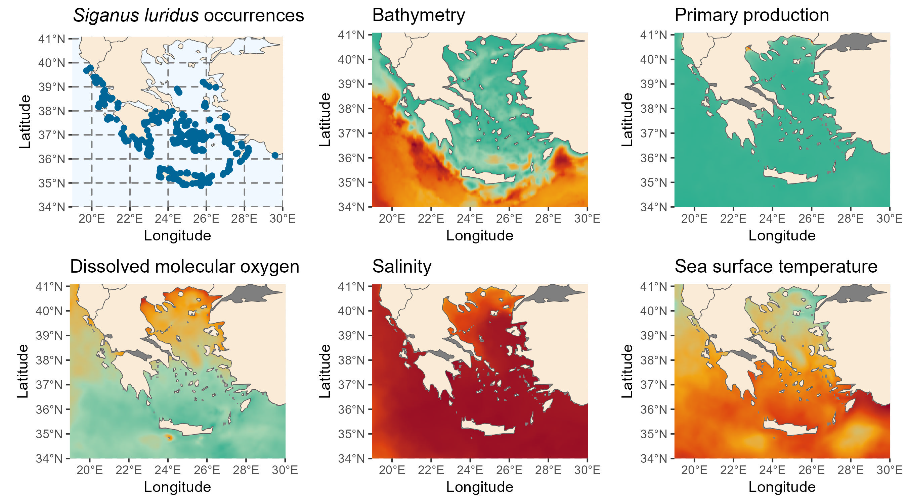
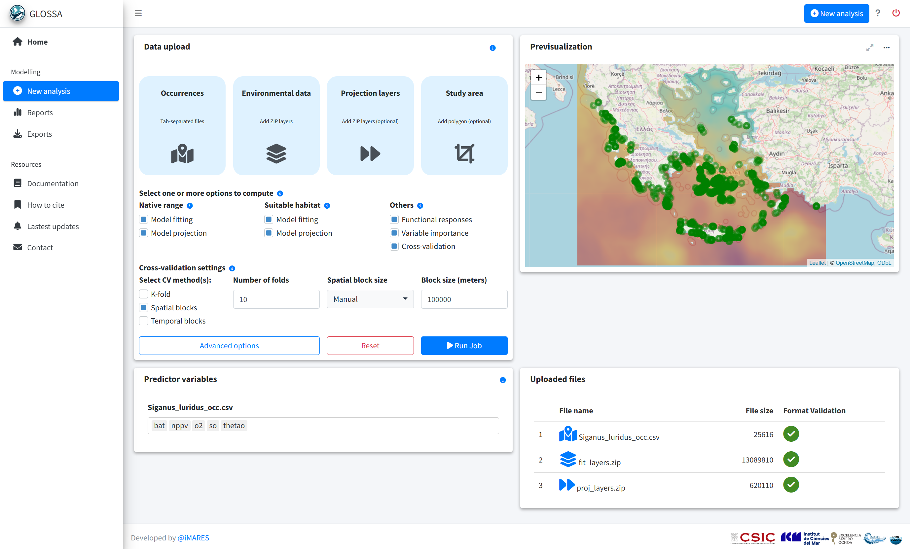
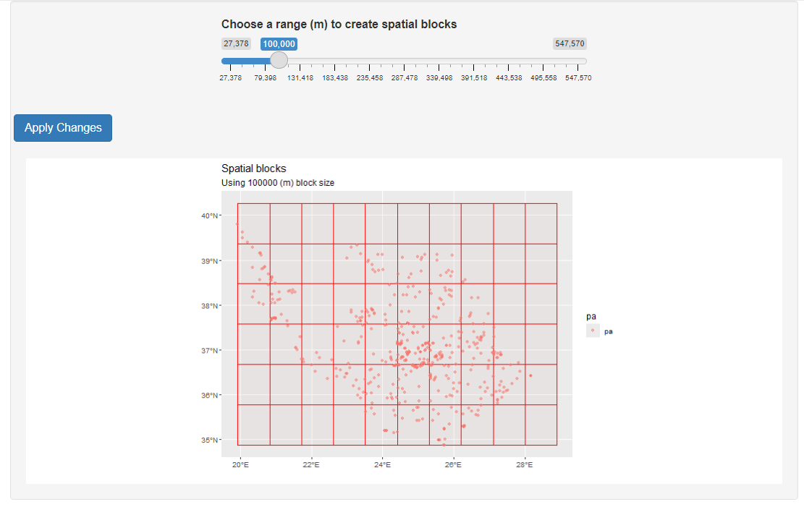
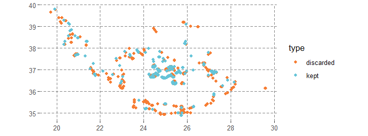
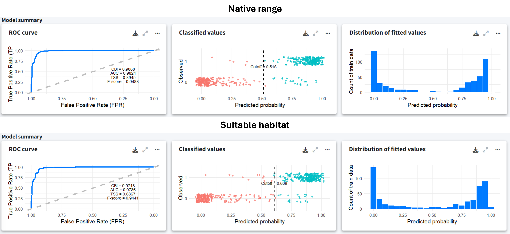
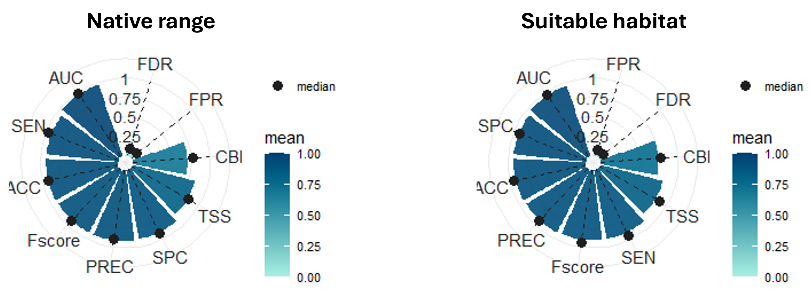
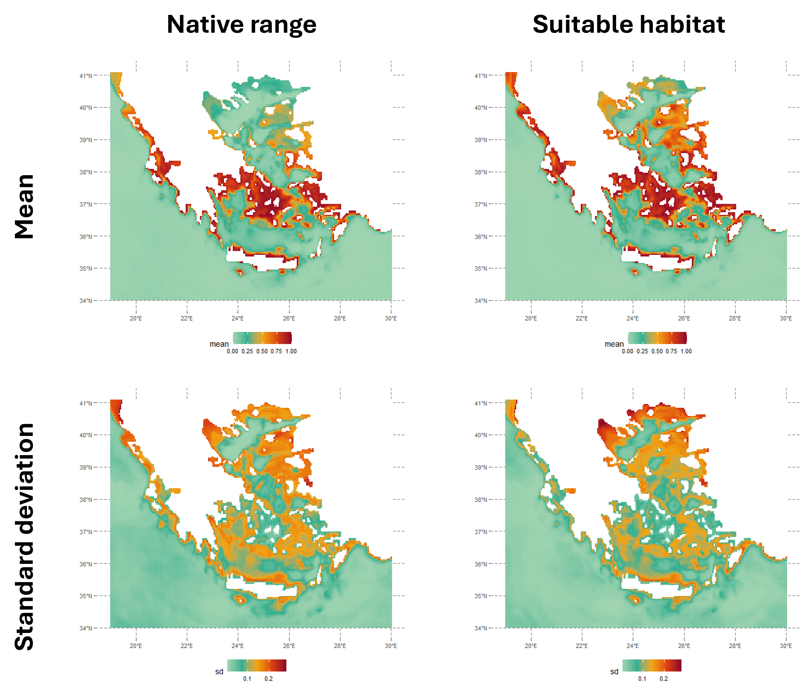
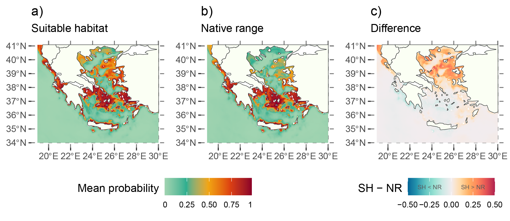

```{r, global_options}
#| echo: false
run_code <- FALSE
```

## Introduction

This example shows how to use GLOSSA to predict the suitable habitat of *Siganus luridus* in the Greek Seas and identify potential areas at risk of invasion. *S. luridus* is one of the many Lessepsian species that have entered the Mediterranean through the Suez Canal, posing challenges to native species, which makes it crucial to predict their potential spread to inform management strategies (Solanou *et al*., 2023).

*S. luridus* was first detected in the Mediterranean in 1955 and has since gradually developed a large population in the eastern Mediterranean (Hassan *et al*, 2003). This species feeds mainly on benthic algae, grazing on rocky habitats (Stergiou, 1988) at depths ranging from 2 to 40 meters (Gothel, 1992). *S. luridus* is one of the most successful Lessepsian fish species, has spines that are venomous to potential predators and has increased its dominance over local grazers (Dikou, 2024).

The goal of this example is to determine the suitable habitat of *S. luridus* and compare it to the native range of the species to identify areas that are currently unoccupied but where conditions are favorable. These areas could become vulnerable if the species overcomes dispersal barriers and biotic interactions. To achieve this, we compare the species' native range with its projected suitable habitat.

The study area is the Greek Seas, where *S. luridus* has begun to enter commercial fisheries and recent surveys have been conducted in this area (Solanou *et al*., 2023). Occurrence data spanning from 2000 to 2020 were obtained from the GreekMarineICAS geodataset, created under the *ALAS: Aliens in the Aegean – A Sea Under Siege* project (<https://alas.edu.gr/>). Environmental data were obtained from the EU Copernicus Marine Environment Monitoring Service (<https://marine.copernicus.eu/>).

{fig-align="center" fig-pos="H"}

We start by loading the required R packages:

```{r}
#| eval: !expr run_code

library(glossa)
library(terra)
library(sf)
library(dplyr)
```

## Data preparation

In this step, we gather and process the occurrence and environmental data for fitting the model.

### Download occurrence data

We download occurrence data for *S. luridus* from the [MedOBIS](https://www.lifewatchgreece.eu/?q=content/medobis) node, specifically from the GreekMarineICAS geodataset, part of the [ALAS project](https://alas.edu.gr/). The dataset is available [here](http://ipt.medobis.eu/archive.do?r=greekmarineicas_geodataset&v=2.0) (Sini *et al*, 2024).

After downloading and unzipping the data, we filter it to retain records of *S. luridus* from 2000 to 2020, aligning with the environmental data's timeframe. Since all records are presences, we set the presence/absence (`pa`) column to 1 to denote presences. We then format the data, saving it as a tab-separated file with `decimalLongitude`, `decimalLatitude`, `timestamp` and `pa` columns.

```{r}
#| eval: !expr run_code

# Unzip and read the data
tmpdir <- tempdir()
zip_contents <- utils::unzip("data/dwca-greekmarineicas_geodataset-v2.0.zip", 
                             unzip = getOption("unzip"), exdir = tmpdir)
luridus <- list.files(tmpdir, pattern = "\\.txt$", full.names = TRUE)
luridus <- read.csv2(luridus, header = TRUE, sep = "\t")

# Filter data for *S. luridus*
luridus <- luridus[luridus$scientificName == "Siganus luridus", ]

# Select and rename columns of interest
luridus <- luridus[, c("decimalLongitude", "decimalLatitude", 
                       "eventDate", "occurrenceStatus")]
luridus$eventDate <- as.numeric(sapply(strsplit(luridus$eventDate, "/|-"), 
                                       function(x) x[[1]]))

# Filter data by event date to match COPERNICUS layers (2000-2020)
luridus <- luridus[luridus$eventDate >= 2000 & luridus$eventDate <= 2020, ]

# Convert occurrence status to binary presence/absence
table(luridus$occurrenceStatus)
luridus$occurrenceStatus <- 1
colnames(luridus) <- c("decimalLongitude","decimalLatitude","timestamp","pa")

# Remove incomplete occurrences
luridus <- luridus[complete.cases(luridus), ]

# Save cleaned data to file
write.table(luridus, file = "data/Siganus_luridus_occ.tsv", sep = "\t", 
            dec = ".", quote = FALSE)
```

### Download environmental data

We download environmental data from the *Copernicus Marine Service* using their Python API. The data includes sea water temperature (`thetao`) and salinity (`so`) from the [Mediterranean Sea Physics Reanalysis](https://doi.org/10.25423/CMCC/MEDSEA_MULTIYEAR_PHY_006_004_E3R1) and primary production (`nppv`) and dissolved oxygen (`o2`) from the [Mediterranean Sea Biogeochemistry Reanalysis](https://doi.org/10.25423/cmcc/medsea_multiyear_bgc_006_008_medbfm3) product. The data is downloaded yearly (2000-2020) at a grid resolution of 1/24 degrees for a depth range of 2 to 40 meters, which corresponds to the species' preferred habitat, as described in [FishBase](https://www.fishbase.se/summary/Siganus-luridus.html) (Gothel, 1992).

```python
import copernicusmarine

# Download temperature data version "202211"
copernicusmarine.subset(
  dataset_id="cmems_mod_med_phy-tem_my_4.2km_P1Y-m",
  variables=["thetao"],
  minimum_longitude=19,
  maximum_longitude=30,
  minimum_latitude=34,
  maximum_latitude=41.1,
  start_datetime="2000-01-01T00:00:00",
  end_datetime="2020-12-31T23:59:00",
  minimum_depth=2,
  maximum_depth=40,
)

# Download salinity data version "202211"
copernicusmarine.subset(
  dataset_id="cmems_mod_med_phy-sal_my_4.2km_P1Y-m",
  variables=["so"],
  minimum_longitude=19,
  maximum_longitude=30,
  minimum_latitude=34,
  maximum_latitude=41.1,
  start_datetime="2000-01-01T00:00:00",
  end_datetime="2020-12-31T23:59:00",
  minimum_depth=2,
  maximum_depth=40,
)

# Download biogeochemical data version "202211"
copernicusmarine.subset(
  dataset_id="cmems_mod_med_bgc-bio_my_4.2km_P1Y-m",
  variables=["nppv", "o2"],
  minimum_longitude=19,
  maximum_longitude=30,
  minimum_latitude=34,
  maximum_latitude=41.1,
  start_datetime="2000-01-01T00:00:00",
  end_datetime="2020-12-31T23:59:00",
  minimum_depth=2,
  maximum_depth=40,
)
```

Once the data is downloaded, we compute the mean values of the environmental variables within the specified depth range. Apart from the dynamic variables, we also include the bathymetry as a static variable. We obtained the bathymetry from the *ETOPO Global Relief Model*, which can be downloaded from [here](https://www.ncei.noaa.gov/products/etopo-global-relief-model). We downloaded the [bedrock elevation netCDF version ETOPO 2022](https://www.ngdc.noaa.gov/thredds/catalog/global/ETOPO2022/60s/60s_bed_elev_netcdf/catalog.html?dataset=globalDatasetScan/ETOPO2022/60s/60s_bed_elev_netcdf/ETOPO_2022_v1_60s_N90W180_bed.nc) with a 60 arc-second resolution.

```{r}
#| eval: !expr run_code

# Load biogeochemical variables
bv <- paste0("cmems_mod_med_bgc-bio_my_4.2km_P1Y-m_nppv",
             "-o2_19.00E-30.00E_34.02N-41.06N_3.17-37.85m_2000-01-01-2020-01-01.nc")
biogeochem_variables <- terra::rast(file.path("data", bv))

# Extract and process layer names
layer_names <- names(biogeochem_variables)
layer_names <- strsplit(layer_names, "_")
layer_names <- do.call(rbind, layer_names)
layer_names <- as.data.frame(layer_names)
colnames(layer_names) <- c("variable", "depth", "year")

# Compute mean values for each year across depths
env_data_year <- list("nppv" = list(), "o2" = list(),
                      "thetao" = list(), "so" = list()) 
for (variable in unique(layer_names$variable)){
  for (year in unique(layer_names$year)){
    indices <- which(layer_names$variable==variable & layer_names$year==year)
    print(paste(variable, year))
    mean_water_column <- terra::mean(biogeochem_variables[[indices]],
                                     na.rm = TRUE)
    env_data_year[[variable]][[year]] <- mean_water_column
  }
}

# Load physical variables
tem <- paste0("cmems_mod_med_phy-tem_my_4.2km_P1Y-m_thetao",
              "_19.00E-30.00E_34.02N-41.06N_3.17-37.85m_2000-01-01-2020-01-01.nc")
phy <- pasteo("cmems_mod_med_phy-sal_my_4.2km_P1Y-m_so",
              "_19.00E-30.00E_34.02N-41.06N_3.17-37.85m_2000-01-01-2020-01-01.nc")
physical_variables <- c(
  terra::rast(file.path("data", tem)),
  terra::rast(file.path("data", phy))
)

# Process physical variables
layer_names <- names(physical_variables)
layer_names <- strsplit(layer_names, "_")
layer_names <- do.call(rbind, layer_names)
layer_names <- as.data.frame(layer_names)
colnames(layer_names) <- c("variable", "depth", "year")

# Mean between different depths
for (variable in unique(layer_names$variable)){
  for (year in unique(layer_names$year)){
    indices <- which(layer_names$variable==variable & layer_names$year==year)
    print(paste(variable, year))
    mean_water_column <- terra::mean(physical_variables[[indices]],
                                     na.rm = TRUE)
    env_data_year[[variable]][[year]] <- mean_water_column
  }
}

# Load and process bathymetry data
bat <- terra::rast("data/ETOPO_2022_v1_60s_N90W180_bed.nc")
bat <- -1 * bat
bat <- terra::aggregate(bat, fact = 5, fun = "mean")
r <- terra::rast(terra::ext(env_data_year[[1]][[1]]), 
                 res = terra::res(env_data_year[[1]][[1]]))
bat <- terra::resample(bat, r)
for (i in seq_len(length(env_data_year[[1]]))){
  env_data_year[["bat"]][[i]] <- bat
}

# Save processed layers to files
dir.create("data/fit_layers")
dir.create("data/fit_layers/bat")
dir.create("data/fit_layers/thetao")
dir.create("data/fit_layers/so")
dir.create("data/fit_layers/nppv")
dir.create("data/fit_layers/o2")
for (i in seq_len(length(env_data_year[[1]]))){
  for (j in names(env_data_year)){
    terra::writeRaster(
      env_data_year[[j]][[i]], 
      filename = paste0("data/fit_layers/", j ,"/", j, "_", i, ".tif")
    )
  }
}

# Compress the layers into a zip file
zip(zipfile = "data/fit_layers.zip", files = "data/fit_layers")
```

We also prepared a separate *proj_layers.zip* file containing only the layers for 2020, allowing us to predict the native range and suitable habitat under "present" conditions.

```r
proj_layers.zip
    ├───bat
    │       bat_21.tif
    ├───nppv
    │       nppv_21.tif
    ├───o2
    │       o2_21.tif
    ├───so
    │       so_21.tif
    └───thetao
            thetao_21.tif
```

## GLOSSA modelling

With the data formatted and ready, we run the GLOSSA Shiny app.

```{r}
#| eval: !expr run_code

run_glossa()
```

We upload the occurrence file for *S. luridus* and the environmental layers for model fitting and projection (in this case, the year 2020). To estimate the native range and suitable habitat, we selected the *Model fitting* and *Model projection* options for both the *Native range* and *Suitable habitat* models. Additionally, we enabled *Functional responses*, *Variable importance* and *Cross-validation* in the *Others* section.

Balanced pseudo-absences were generated within the study area. In the advanced options, we standardize the environmental data, choose the BART model (Chipman, *et al.*, 2010; Dorie, 2024) and set the seed to 1984 for reproducibility.

{fig-align="center" fig-pos="H"}

To evaluate model performance, we applied spatial block cross-validation with 10 folds. On a first attempt we determined block size using the range of the spatial autocorrelation of the residuals. However, block size was very small (~11 km) so we decided to increase the block size manually to 100 km. For assisting this process we used the `cv_block_size()` function from the `blockCV` (Valavi *et al.*, 2018) R package that launches an R `shiny` application.

{width=60% fig-align="center" fig-pos="H"}

## Results

The model was fitted with 256 presences and 256 pseudo-absences. Many presence points were excluded due to their proximity to the coast, where the environmental layers from COPERNICUS lack data. Future analyses could benefit from using environmental data sources with better coastal resolution or imputing values. For this example, this exclusion demonstrates how GLOSSA handles these situations.

{width=60% fig-align="center" fig-pos="H"}

Despite the data limitations, the model summary indicates good performance, with clear classification between presences and pseudo-absences for both models.

{fig-align="center" fig-pos="H"}

To assess the predictive performance, we applied a 10-fold spatial-block cross-validation. The evaluation metrics indicate overall solid performance, with high AUC and precision. The F-score and TSS also suggest that the model is well balanced. However, as we are working with pseudo-absences and not real absences, these metrics should be interpreted with caution. For this reason, we also computed the Continuous Boyce Index (CBI), which is a presence-only metric that ranges from −1 to 1, where values close to zero indicate that the presence predictions are not better than those from a random model. In this case, the CBI is moderate, which is expected due to the large size of the spatial blocks used in the cross-validation. These blocks impose strong independence constraints on validation data and may force the model to extrapolate on new environmental conditions. Although the model could be improved by refining covariates or using target-group pseudo-absences, the current model fits our purpose as we are not aiming to extrapolate far beyond the study area.

{width=60% fig-align="center" fig-pos="H"}

The figure below shows the native range and suitable habitat predictions for 2020. The suitable habitat model highlights areas with favorable environmental conditions for the species, regardless of where the species currently exists. In contrast, the native range represents the species' current distribution, considering spatial smoothing with latitude and longitude included as predictors in the model.

{width=60% fig-align="center" fig-pos="H"}

When we subtract the predictions of the native range from the suitable habitat you get a map showing positive values in areas where conditions are favorable (according to the suitable habitat model), but the species is not currently present (according to the native range model). Positive values are particularly interesting as they highlight regions with suitable conditions but where the species has not been established yet, so they may indicate areas at risk of future invasion.

{fig-align="center" fig-pos="H"}

For example, the Thracian Sea and northeast Aegean islands were identified as high-risk areas for potential invasion, even though the species is not currently established there according to the predicted native range in 2020. However, uncertainty is high in the Thracian Sea predictions as the environmental conditions are outside the range of the ones matching the occurrence records. Moreover, suitable environmental conditions do not guarantee that the species will establish; there are dispersal limitations, biotic interactions and barriers that could prevent invasion.

## Conclusion

Using GLOSSA and environmental data, we have modelled the potential suitable habitat for *S. luridus* and shown an example of how species distribution modelling can be used to assess areas of potential invasive species risk.

## Computation time

The table below summarizes the computation times for the various steps of the GLOSSA analysis, providing an overview of the computational resources required at each step. The analysis was performed on a single Windows 11 machine equipped with 64 GB of RAM and an Intel(R) Core(TM) i7-1165G7 processor. This processor features 4 cores and 8 threads, with a base clock speed of 2.80 GHz.

<p align="center"><b>Table 1.</b> Computation times for different steps of the GLOSSA analysis for <i>S. luridus</i> in the Greek Seas.</p>
| **Task**                            | **Execution time**         |
|-------------------------------------|----------------------------|
| Loading input data                  | 1.82 secs                  |
| Processing P/A coordinates           | 0.004 secs                 |
| Processing covariate layers          | 1.13 secs                  |
| Building model matrix               | 10.30 secs                  |
| Fitting native range models         | 0.02 mins                 |
| Variable importance (native range)   | 0.50 mins                  |
| P/A cutoff (native range)            | 0.01 mins                 |
| Projections on fit layers (native range) | 0.49 mins             |
| Native range projections            | 0.79 mins                  |
| Fitting suitable habitat models     | 0.01 mins                 |
| Variable importance (suitable habitat) | 0.35 mins               |
| P/A cutoff (suitable habitat)       | 0.01 mins                 |
| Projections on fit layers (suitable habitat) | 0.64 mins          |
| Suitable habitat projections        | 0.30 mins                  |
| Habitat suitability                 | 0.002 mins                 |
| Computing functional responses      | 0.56 mins                  |
| Cross-validation                    | 0.46 mins                  |
| **Total GLOSSA analysis**           | **3.30 mins**              |

## References

- Chipman, H. A., George, E. I., & McCulloch, R. E. (2010). BART: Bayesian additive regression trees. *The Annals of Applied Statistics*, 4(1):266 – 298.

- Dikou, A. (2024). Depletion fishing of the alien fish species *Siganus luridus*, *S. rivulatus*, *Pterois miles*, and *Etrumeus golanii* in the Mediterranean Sea-gear, ecosystem impacts, and resolution. *Fisheries Research, 278*, 107095.

- Dorie V. (2025). *dbarts: Discrete Bayesian Additive Regression Trees Sampler*. R package version 0.9-32, <https://CRAN.R-project.org/package=dbarts>.

- Gothel, H. (1992). Fauna marina del Mediterráneo. *Ediciones Omega, SA, Barcelona, 319*.

- Hassan, M., Harmelin-Vivien, M., & Bonhomme, F. (2003). Lessepsian invasion without bottleneck: example of two rabbitfish species (*Siganus rivulatus* and *Siganus luridus*). *Journal of Experimental Marine Biology and Ecology, 291*(2), 219-232.

- Sini M, Ragkousis M, Koukourouvli N, Katsanevakis S & Zenetos A (2024). Marine impactful cryptogenic and alien species in the Greek Seas: A georeferenced dataset (1893-2020). Version 2.0. Hellenic Center for Marine Research. Occurrence dataset. <https://doi.org/10.25607/t2smha>

- Solanou, M., Valavanis, V. D., Karachle, P. K., & Giannoulaki, M. (2023). Looking at the expansion of three demersal lessepsian fish immigrants in the Greek Seas: What can we get from spatial distribution modeling?. *Diversity, 15*(6), 776.

- Stergiou, K. I. (1988). Feeding habits of the Lessepsian migrant *Siganus luridus* in the eastern Mediterranean, its new environment. *Journal of fish biology, 33*(4), 531-543.

- Valavi, R., Elith, J., Lahoz‐Monfort, J. J., & Guillera‐Arroita, G. (2018). blockCV: An R package for generating spatially or environmentally separated folds for k-fold cross‐validation of species distribution models. *Methods in Ecology and Evolution, 10*(2), 225-232.
